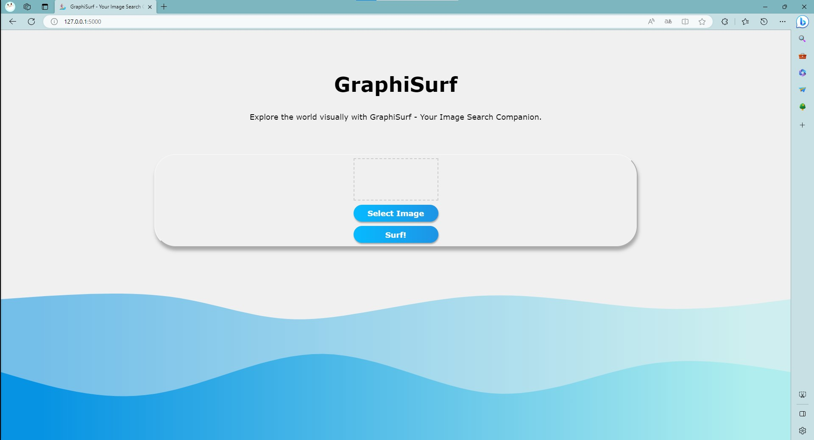
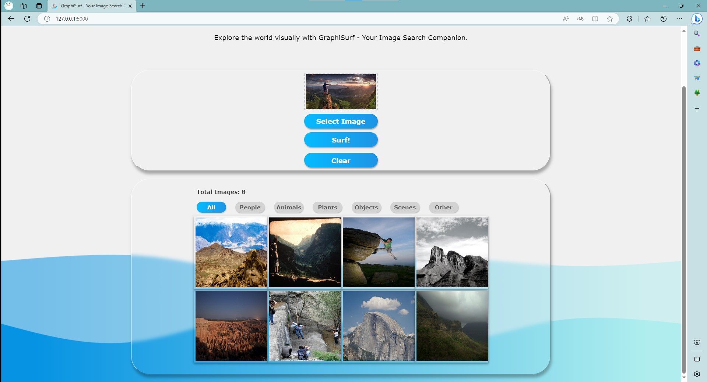

# GraphiSurf

Tongji University · Spring 2023 · Human-Computer Interaction · Coursework

GraphiSurf is an image search engine that allows you to search for images by uploading an image. It is a web application that uses a deep learning model to extract features from images and then uses a similarity search algorithm to find similar images. The deep learning model will be trained locally on your computer. The web application will be deployed locally on your computer. You can use GraphiSurf to search for images without uploading them to the cloud.

**Note: Chrome & Edge are recommended.**





## Installation

To install GraphiSurf, download all the files to your preferred location on your computer. You should have installed Python 3.7 and the following packages:

- `Flask`
- `Flask-HTTPAuth`
- `NumPy`
- `TensorFlow 2.2.0`
- `SciPy`
- `Imageio`
- `Protobuf 3.19`

Command:

```pip install flask flask-httpauth numpy tensorflow==2.2.0 scipy imageio protobuf==3.19```

## Usage

To use GraphiSurf, make sure you have installed Python 3.7 and the required packages. Then, open the command prompt and navigate to the GraphiSurf folder. Run the following command:

```python image_vectorizor.py```

This command will train the deep learning model and save the model to the GraphiSurf folder. The training process may take a few minutes. After the training process is complete, run the following command:

```python rest-server.py```

This command will start the web application. It will also open the web application in your default browser. If not, you can open the web application by typing one of the following URLs in your browser:

```http://127.0.0.1:5000/``` or ```http://100.81.4.37:5000/```

You can now use GraphiSurf to search for images.

To search for images, click the **"Select Image"** button and select an image. Then, click the **"Surf!"** button. The web application will display up to 12 most similar images. You can click on the filter buttons to filter the results. You can also click on the download button over an image to download the image. To search for another image, click the **"Select Image"** button again and select another image. To clear the results, click the **"Clear"** button.

## Features

- Search for images by uploading an image
- Filter the results by image category
- Download the results

## Technologies Used

- Python 3.7
- Flask
- Flask-HTTPAuth
- NumPy
- TensorFlow 2.2.0
- SciPy
- Imageio
- Protobuf 3.19

## Credits

This project uses the following third-party resources:

- Flask: <https://pypi.org/project/Flask/>
- Flask-HTTPAuth: <https://pypi.org/project/Flask-HTTPAuth/>
- NumPy: <https://pypi.org/project/numpy/>
- TensorFlow: <https://pypi.org/project/tensorflow/>
- SciPy: <https://pypi.org/project/scipy/>
- Imageio: <https://pypi.org/project/imageio/>
- Protobuf: <https://pypi.org/project/protobuf/>
- Bootstrap: <https://cdn.jsdelivr.net/>
- W3Schools: <https://www.w3schools.com/>
- Ajax: <https://ajax.aspnetcdn.com/>

This project also uses the following resources on the Internet:

- Svg Wave: <https://svgwave.in/>
- Glass Morphism: <https://glassgenerator.netlify.app/#>

## Contact

If you have any questions or feedback, please contact me at <2151268@tongji.edu.cn>.
